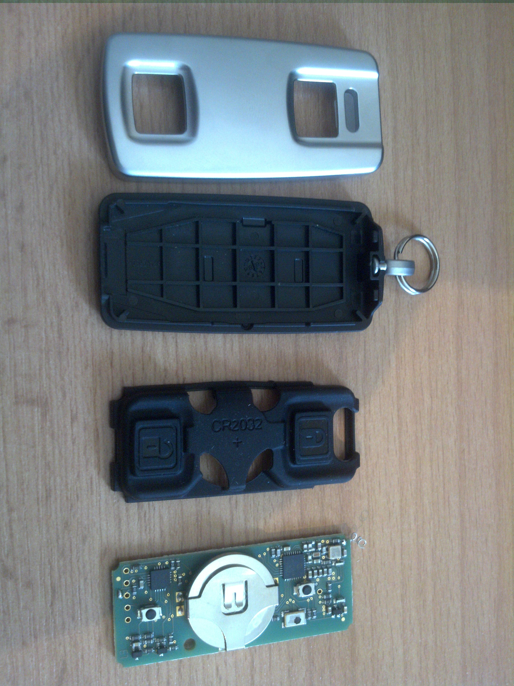
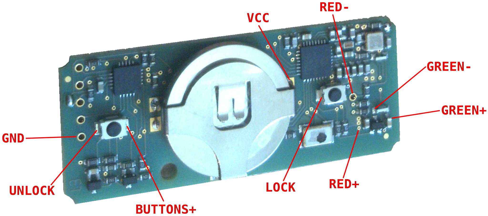
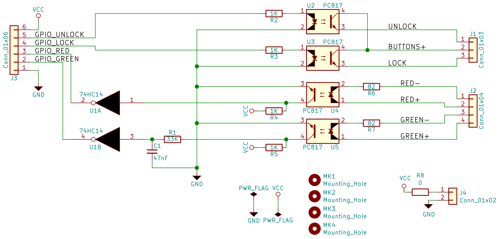

CFF3000 GPIO interface
======================

This repository contains information how to interface a Abus CFF3000
remote control with a Raspberry Pi or similar development board using
GPIOs. First of all one needs to disassemble the remote control. Be
careful when removing the rubber part from the PCB to avoid tearing
off the antenna.

Next step: Soldering a couple of wires. I tried to tap the signals
at locations, that are as simple to solder as possible. Unfortunately
tapping the LEDs is a bit tricky. Note, that the CFF3000 design is
"interesting" and does not use a common ground/vcc for the buttons
and LEDs.

To work around the problem with uncommon ground/vcc, I made a small
single layer PCB. Some explanations for the schematics: The CFF3000
is connected on the right side of the schematics. Each buttons is
connected to a opto-coupler, the other side of the opto-coupler is
connected to the computer's GPIO through a resistor as current limiter.
The LEDs are also connected to a opto-coupler, but the signal is
additionally inverted and cleaned by a schmitt-trigger. This was
necessary for proper reading of the green LED. Also the green LED
channel has a 100Hz RC lowpass filter (47nF, 33K), since it is driven
with a 1KHz PWM signal by the CFF3000 and we want a logical 1 or 0
instead.

License
=======

© 2018 Sebastian Reichel

ISC License

Permission to use, copy, modify, and/or distribute this software for
any purpose with or without fee is hereby granted, provided that the
above copyright notice and this permission notice appear in all copies.

THE SOFTWARE IS PROVIDED "AS IS" AND THE AUTHOR DISCLAIMS ALL WARRANTIES
WITH REGARD TO THIS SOFTWARE INCLUDING ALL IMPLIED WARRANTIES OF
MERCHANTABILITY AND FITNESS. IN NO EVENT SHALL THE AUTHOR BE LIABLE FOR
ANY SPECIAL, DIRECT, INDIRECT, OR CONSEQUENTIAL DAMAGES OR ANY DAMAGES
WHATSOEVER RESULTING FROM LOSS OF USE, DATA OR PROFITS, WHETHER IN AN
ACTION OF CONTRACT, NEGLIGENCE OR OTHER TORTIOUS ACTION, ARISING OUT OF
OR IN CONNECTION WITH THE USE OR PERFORMANCE OF THIS SOFTWARE.
